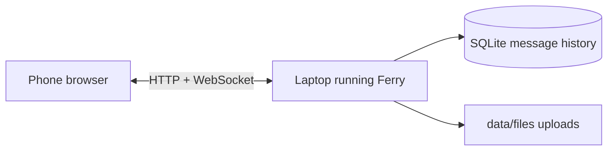

<p align="center">
  
</p>

<h1 align="center">Ferry</h1>

<p align="center">
  A tiny local bridge for notes and files between your laptop and phone.
</p>

<p align="center">
  <a href="LICENSE"></a>
  
  
</p>

Ferry gives your own devices one shared thread on your local network. Drop in a note, photo, PDF, APK, or anything else, and it shows up on the other screen without signing in, uploading to a cloud drive, or hunting for a cable.

It is deliberately small: one Node server, one browser UI, one SQLite database, and files stored on your laptop.

## Why Ferry?

- **Fast local handoff:** send text and files between phone and laptop on the same Wi-Fi.
- **No account:** the laptop is the server; the phone is just a browser client.
- **Persistent thread:** messages stay in a local SQLite database.
- **Built for daily use:** QR connect, image previews, lightbox, light/dark/system themes, and storage cleanup.
- **Desktop-aware:** files already on the laptop can be opened or revealed in Explorer.

## How It Fits Together



## Quick Start

```powershell
npm install
npm start
```

Ferry prints a laptop URL and one or more phone URLs. Open the laptop URL locally, then press **Connect** and scan the QR code from your phone.

By default Ferry listens on port `8787`.

```powershell
$env:PORT=8790
npm start
```

## Windows Helper

Ferry includes a lightweight Windows helper for daily use:

```powershell
npm run install:windows
```

That creates a Start menu shortcut named **Ferry** and a per-user autostart entry. The helper keeps a notification-area icon alive, starts the server, opens Ferry in your default browser, copies the phone URL, and can restart or stop the server.

You can also run it manually:

```powershell
npm run tray
```

To remove the Start menu shortcut and autostart entry:

```powershell
npm run uninstall:windows
```

## Features

| Area | What Ferry does |
| --- | --- |
| Messages | Send short notes between devices in one shared thread. |
| Files | Upload, download, open, and reveal transferred files. |
| Images | Show thumbnails and a lightbox for image uploads. |
| Connect | Show a QR code for the current LAN address. |
| Appearance | Light, dark, and system theme modes. |
| Storage | Show usage and clean up older uploaded files. |

## Project Layout

```text
server.js              HTTP, WebSocket, upload, download, cleanup
public/index.html      App shell
public/app.js          Client state and UI behavior
public/style.css       Theme and layout
public/vendor/         Offline QR generator
data/                  Local runtime data, ignored by git
```

## Security Scope

Ferry is for a trusted home network.

There is no authentication yet. Anyone who can reach the Ferry URL on your network can read the thread, post messages, upload and download files, and use host-side open/reveal actions. Do not expose Ferry to public Wi-Fi, the open internet, or a forwarded port.

Shared-token access is the next major security step.

## Tech

- Node.js with native `node:sqlite`
- `ws` for live updates
- Vanilla HTML, CSS, and JavaScript
- Vendored `qrcode-generator` for offline QR codes

## Credits

Ferry vendors `public/vendor/qrcode.js`, based on `qrcode-generator` by Kazuhiko Arase, under the MIT License.

## License

MIT. See [LICENSE](LICENSE).
