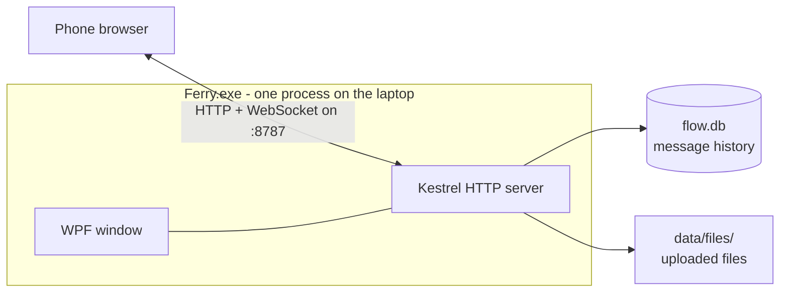

<p align="center">
  
</p>

<h1 align="center">Ferry</h1>

<p align="center">
  A tiny local bridge for notes and files between your laptop and phone.
</p>

<p align="center">
  <a href="LICENSE"></a>
  <a href="https://github.com/strix52/ferry/releases/latest"></a>
  
  
  
</p>

Ferry gives your own devices one shared thread on your local network. Drop in a note, photo, PDF, APK, or anything else, and it shows up on the other screen without signing in, uploading to a cloud drive, or hunting for a cable.

The laptop is the server; the phone is a browser tab. Ferry is deliberately small: one C# executable hosting Kestrel in-process behind a native WPF window, one SQLite database, and uploaded files sitting on your own disk.

> **Personal beta.** Ferry covers the daily transfer basics. It is an unsigned, LAN-only utility, not a hardened internet service. Use it only on a network you trust.

## Download

Download `ferry-windows-x64-v0.16.0.zip` from [the latest release](https://github.com/strix52/ferry/releases/latest), verify its SHA-256 against the accompanying checksum file, and extract the whole archive before running `Ferry.exe`.

The release is self-contained for 64-bit Windows. It does not need Node.js or a separately installed .NET runtime. Because the executable is not code-signed, Windows may show a reputation warning on first launch.

Keep the `public` folder beside `Ferry.exe`; it contains the phone interface.

## Windows install

Ferry includes a source-install script for daily autostart:

```powershell
npm run install:windows
```

That builds the release executable, creates a Start menu shortcut named **Ferry**, and adds a per-user autostart entry. Ferry then runs from the notification area, serving in-process and raising a Windows notification when something arrives.

To remove the Start menu shortcut and autostart entry:

```powershell
npm run uninstall:windows
```

## Features

| Area | What Ferry does |
| --- | --- |
| Messages | Send short notes between devices in one shared thread. |
| Files | Upload, download, open, and reveal transferred files. |
| Images | Show thumbnails and a lightbox for image uploads. |
| Connect | Show a QR code with the current LAN address and pairing token. |
| Appearance | Light, dark, and system theme modes. |
| Storage | Show usage and clean up older uploaded files. |

Press `Ctrl+Alt+F` to bring Ferry to the front. The same action is available from its notification-area icon.

## Security scope

Ferry is for a trusted home network, and its only boundary is a shared pairing token. Scan the QR code from the laptop once; the phone stores the token for later visits.

Do not expose Ferry to public Wi-Fi, the open internet, or a forwarded port. The token keeps casual LAN access out. It does not make Ferry safe as an internet-facing service.

See [SECURITY.md](SECURITY.md) for the current security boundary and reporting guidance.

## Current limits

- Windows x64 host only; the phone side is a browser client.
- Trusted local network only, over plain HTTP.
- No code signing or automatic updater.
- No accounts, cloud relay, folder sync, search, or multi-user permissions.

## Architecture


```mermaid
flowchart LR
  Phone["Phone browser"]
  subgraph Ferry["Ferry.exe - one process on the laptop"]
    WPF["WPF window"]
    Kestrel["Kestrel HTTP server"]
  end
  Phone <-->|"HTTP + WebSocket on :8787"| Kestrel
  WPF --- Kestrel
  Kestrel --> DB[("flow.db<br/>message history")]
  Kestrel --> Files["data/files/<br/>uploaded files"]
```

There is no background service and no second process. Closing the window leaves Ferry serving from the notification area; **Exit** in its tray menu ends the process and the server together.

## Build from source

Requires the .NET 10 SDK. Node.js 24 or newer is needed only for the browser and protocol test suites.

```powershell
dotnet build src/Ferry/Ferry.slnx -c Release
dotnet run --project src/Ferry/Ferry -c Release
```

Ferry opens its window and shows a pairing QR code. Scan it from the phone to connect over the LAN.

By default Ferry listens on port `8787`. Set `FERRY_PORT` to override.

## Project layout

```text
src/Ferry/             WPF app, Kestrel server library, standalone host
public/index.html      App shell
public/app.js          Client state and UI behavior
public/style.css       Theme and layout
public/vendor/         Offline QR generator
data/                  Local runtime data, ignored by git
```

## Tech

- .NET 10 (C#, WPF, ASP.NET Core Kestrel in-process)
- `Microsoft.Data.Sqlite`
- Vanilla HTML, CSS, and JavaScript for the phone client
- Vendored `qrcode-generator` for offline QR codes

## Verification

```powershell
dotnet test src/Ferry/Ferry.slnx -c Release
npm test
npm run conformance
```

The conformance suite is the compatibility gate for the frozen browser/server protocol.

## Credits

Ferry vendors `public/vendor/qrcode.js`, based on `qrcode-generator` by Kazuhiko Arase, under the MIT License.

## License

MIT. See [LICENSE](LICENSE).
